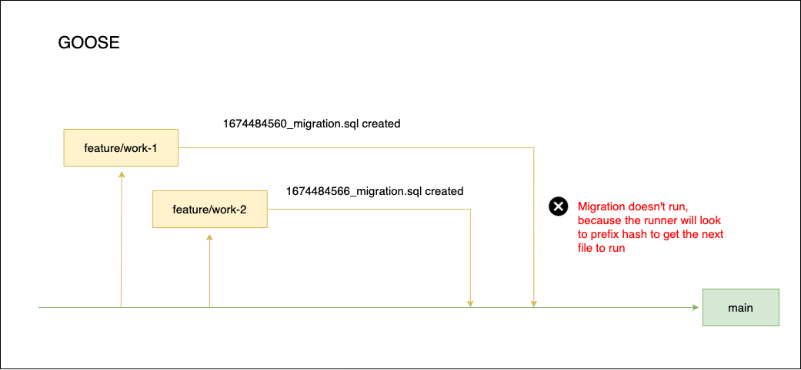
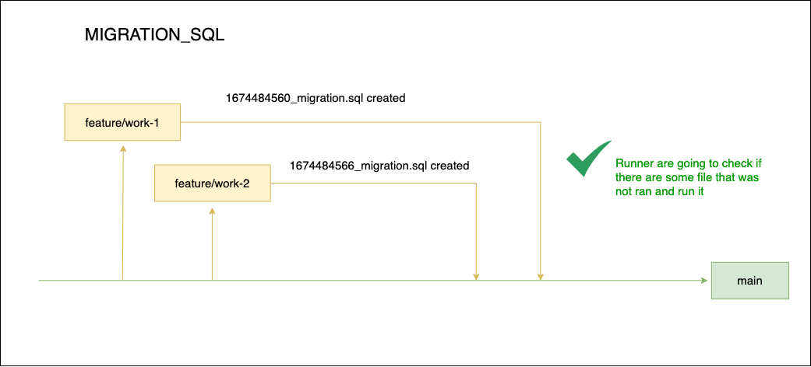

# MIGRATION SQL

To install you have to just run:
```shell
go install github.com/leomirandadev/migration_sql/cmd/migration_sql@latest
```

Support following SQL Databases:
- `mysql`
- `postgres`


# HOW IT WORKS

If you are using some migration engine like goose, you probably see that when you are working with multiple branches, some migrations didn't run correctly. The reason is:



In this repository, the migration execution it doesn't look just to filename, but we look to all migrations that was ran, and check if some file doesn't run. Like this:




# USAGE

## Create
```shell
migration_sql --create migration_name
```
If you want to inform the dir, you can do:
```shell
migration_sql --create migration_name --dir ./migrations_assets
```

## Run
```shell
migration_sql --up mysql --conn "root:root@tcp(127.0.0.1:3306)/your_database_name"
```

If you want to inform the dir, you can do:
```shell
migration_sql --up mysql --conn "root:root@tcp(127.0.0.1:3306)/your_database_name" --dir ./migrations_assets
```

## Rollback
```shell
migration_sql --down mysql --conn "root:root@tcp(127.0.0.1:3306)/your_database_name"
```

If you want to inform the dir, you can do:
```shell
migration_sql --down mysql --conn "root:root@tcp(127.0.0.1:3306)/your_database_name" --dir ./migrations_assets
```

## Rollback Group

With this command you can rollback the last migrations ran in one execution. So if in your last execution 3 migrations ran, you have just inform "--down-group" to rollback them.

```shell
migration_sql --down-group mysql --conn "root:root@tcp(127.0.0.1:3306)/your_database_name"
```

If you want to inform the dir, you can do:
```shell
migration_sql --down-group mysql --conn "root:root@tcp(127.0.0.1:3306)/your_database_name" --dir ./migrations_assets
```
